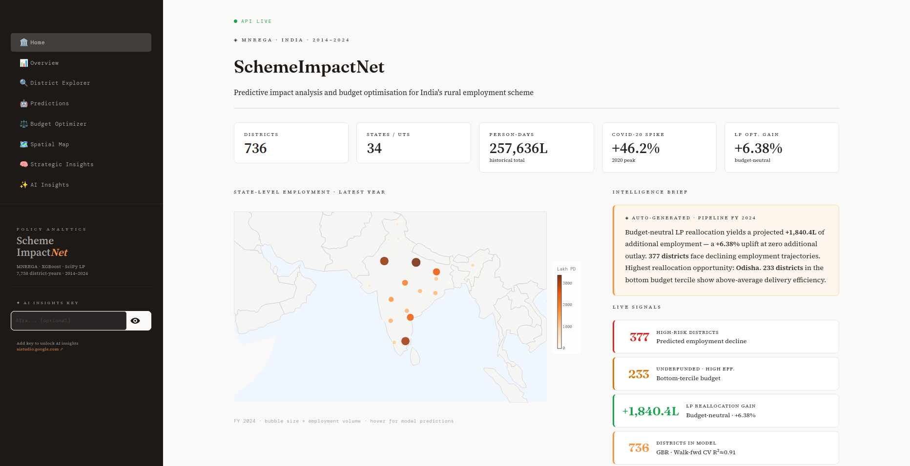
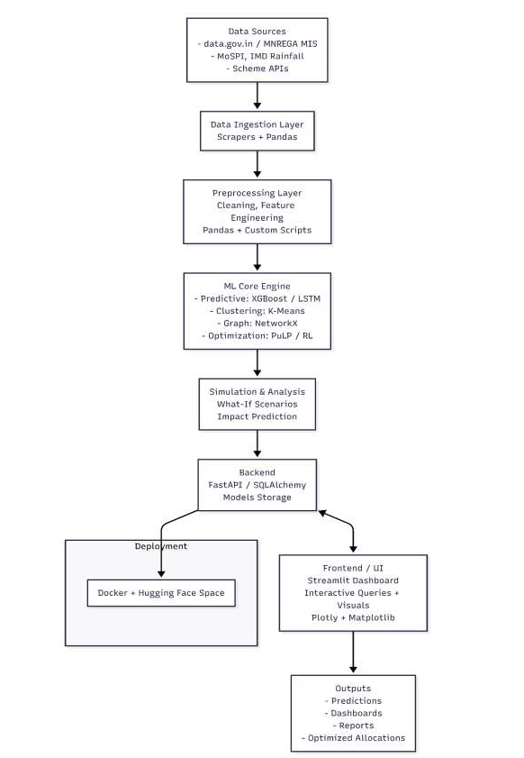

## SchemeImpactNet

**AI powered Decision Support System for MNREGA Employment Forecasting & Budget Optimization.**



- Space Link: https://huggingface.com/sammeeer/SchemeImpactNet
- Live Demo: https://sammeeer-schemeimpactnet.hf.space/

---

### Overview 

SchemeImpactNet is an end-to-end AI-powered decision support system designed to analyze, forecast, and optimize employment generation under the **Mahatma Gandhi National Rural Employment Guarantee Act (MNREGA)**.

The project combines **data engineering**, **machine learning**, **mathematical optimization**, and **interactive analytics** into a unified platform that assists policymakers in making informed budget allocation decisions.

Starting from raw district-level historical records, the pipeline performs data cleaning, feature engineering, and temporal modeling to forecast employment demand across districts. These predictions are then used by a two-stage Linear Programming optimization engine that reallocates existing budgets to maximize projected person-days **without increasing total expenditure**.

The system exposes its results through a FastAPI backend and an interactive dashboard that enables users to explore historical trends, district-level forecasts, optimization recommendations, spatial visualizations, and strategic policy insights.

### Key Capabilities

* Forecast district-level MGNREGA employment using a leak-free machine learning pipeline.
* Engineer temporal features from historical employment trends.
* Evaluate multiple regression models using walk-forward cross-validation.
* Optimize budget allocation through Linear Programming while preserving the overall budget.
* Explore district-wise historical performance and prediction accuracy.
* Visualize employment forecasts on an interactive map of India.
* Generate strategic insights highlighting high-risk districts, efficiency leaders, and budget reallocation opportunities.

---

### System Architecture 

SchemeImpactNet follows a modular end-to-end architecture that transforms raw MGNREGA records into actionable policy recommendations.



#### Architecture Components

#### 1. Data Engineering Layer

Processes raw MGNREGA records into a clean and consistent dataset through validation, preprocessing, missing value handling, and standardization. This layer ensures reliable input for downstream machine learning tasks.


#### 2. Feature Engineering Layer

Generates meaningful predictive features such as historical lags, rolling statistics, district trends, and temporal indicators. It also removes data leakage by excluding features that directly reveal the target variable.


#### 3. Machine Learning Layer

Trains and evaluates multiple regression models using walk-forward cross-validation to forecast district-level employment demand. The best-performing model is selected based on evaluation metrics and used for prediction.


#### 4. Budget Optimization Layer

Uses predicted employment demand to recommend district-wise budget allocations through a two-stage optimization strategy combining rank-based allocation and Linear Programming, while preserving the total available budget.


#### 5. Backend API Layer

FastAPI serves historical data, predictions, optimization results, and live model inference through REST APIs. Processed datasets are stored in SQLite for efficient querying and retrieval.


#### 6. Interactive Dashboard Layer

Provides an interactive interface to explore historical trends, employment forecasts, optimization results, and strategic insights. The dashboard consumes backend APIs to deliver real-time visual analytics for policymakers.

---

### Feature Engineering

The model uses a set of carefully engineered temporal and statistical features instead of relying solely on raw MGNREGA records. These features capture historical employment trends, district characteristics, and temporal patterns while avoiding data leakage.

| Feature                                            | Description                                                                                               |
| -------------------------------------------------- | --------------------------------------------------------------------------------------------------------- |
| **Lag-1 Person-Days (`lag1_pd`)**                  | Previous year's employment, serving as the strongest predictor of future demand.                          |
| **Lag-2 Person-Days (`lag2_pd`)**                  | Employment generated two years earlier, providing longer-term historical context.                         |
| **Lag-3 Person-Days (`lag3_pd`)**                  | Employment from three years prior to capture long-term trends.                                            |
| **2-Year Rolling Mean (`roll2_pd`)**               | Average employment over the previous two years to smooth short-term fluctuations.                         |
| **3-Year Rolling Mean (`roll3_pd`)**               | Average employment across the previous three years for stable trend estimation.                           |
| **Rolling Standard Deviation (`roll_std_pd`)**     | Measures year-to-year variability in employment, helping the model identify volatile districts.           |
| **COVID-Adjusted Lag (`lag1_adj`)**                | Previous year's employment adjusted using a COVID normalization factor to reduce pandemic-induced bias.   |
| **Year-over-Year Growth (`lag_yoy`)**              | Percentage change in employment between consecutive historical years.                                     |
| **Employment Momentum (`momentum`)**               | Measures whether employment growth is accelerating or decelerating over time.                             |
| **District Capacity (`district_capacity`)**        | Expanding historical average representing the long-term employment-generating capacity of a district.     |
| **Blended Capacity (`blended_capacity`)**          | Combines district and state historical averages to improve robustness for districts with limited history. |
| **Relative State Performance (`relative_state`)**  | Ratio of district employment to the corresponding state average, capturing regional context.              |
| **Z-Score (`lag1_zscore`)**                        | Indicates how unusual the previous year's employment was compared to historical trends.                   |
| **Extreme Event Flag (`lag1_extreme`)**            | Binary indicator identifying statistically significant employment anomalies.                              |
| **State-Level Features**                           | Aggregated state statistics that provide regional economic context for district-level predictions.        |
| **Temporal Flags (`is_covid`, `is_2022_anomaly`)** | Indicators for special periods such as the COVID-19 pandemic and known reporting anomalies.               |
| **Average Wage Rate (`avg_wage_rate`)**            | Government wage rate used as an external explanatory feature influencing employment generation.           |

### Leakage Prevention

To ensure fair forecasting, highly correlated features that directly revealed the target variable were removed from training, including:

* `works_completed`
* `expenditure_lakhs`
* `budget_allocated_lakhs`
* `households_demanded`
* `households_offered`
* `households_availed`

This leakage audit ensures that the model learns genuine temporal relationships instead of memorizing information unavailable at prediction time.

---

### Machine Learning Pipeline

SchemeImpactNet employs a supervised regression pipeline to forecast district-level MGNREGA employment demand. The workflow combines temporal feature engineering, walk-forward cross-validation, and ensemble learning to generate reliable district-level forecasts while preventing data leakage.

### Model Summary

| Metric                  |                                  Value |
| ----------------------- | -------------------------------------: |
| **Prediction Task**     | District-level Person-Days Forecasting |
| **Learning Type**       |                  Supervised Regression |
| **Training Records**    |                 ***(Update from UI)*** |
| **Districts Covered**   |                                **736** |
| **States & UTs**        |                                 **36** |
| **Financial Years**     |                        **2016 – 2024** |
| **Engineered Features** |                                 **17** |
| **Models Evaluated**    |                                  **6** |
| **Cross Validation**    |                Walk-Forward Validation |
| **Selected Model**      |            Gradient Boosting Regressor |
| **Evaluation Metrics**  |                    R², MAE, RMSE, MAPE |
| **Model Serialization** |                        Pickle (`.pkl`) |

### Pipeline Workflow

```text
Raw Dataset
     │
     ▼
Data Extraction
     │
     ▼
Data Cleaning
     │
     ▼
Feature Engineering
     │
     ▼
Leakage Audit
     │
     ▼
Walk-Forward Cross Validation
     │
     ▼
Model Comparison
     │
     ▼
Gradient Boosting Selected
     │
     ▼
Final Model Training
     │
     ▼
District-Level Employment Forecasts
```

### Models Evaluated

| Algorithm                   | Description                                                             |
| --------------------------- | ----------------------------------------------------------------------- |
| Gradient Boosting Regressor | **Final selected model** based on cross-validation performance.         |
| Random Forest Regressor     | Ensemble tree-based regression baseline.                                |
| XGBoost Regressor           | Gradient boosting benchmark for high-performance prediction.            |
| LightGBM Regressor          | Histogram-based boosting algorithm optimized for speed and scalability. |
| Ridge Regression            | Linear regression with L2 regularization.                               |
| ElasticNet Regression       | Linear regression combining L1 and L2 regularization.                   |

## Model Performance

The final **Gradient Boosting Regressor** was evaluated using a leak-free walk-forward validation strategy, ensuring predictions for each financial year were generated using only historical information. This prevents future data leakage and provides a realistic estimate of deployment performance.

### Overall Performance

| Metric | Value | Description |
|--------|------:|-------------|
| **R² Score** | **0.9597** | Explains approximately **95.97%** of the variance in district-level employment. |
| **RMSE** | **7.771 L** | Root Mean Squared Error between predicted and actual person-days. |
| **MAE** | **4.778 L** | Average absolute prediction error across all districts. |
| **Mean Bias** | **+0.125 L** | Nearly unbiased predictions with minimal systematic overestimation. |

### Walk-Forward Cross Validation Results

| Test Year | R² | MAE (Lakh PD) | Observation |
|-----------|----:|--------------:|-------------|
| **2018** | **0.916** | **6.639** | Strong generalization |
| **2019** | **0.926** | **6.380** | Stable performance |
| **2020** | **0.835** | **12.681** | COVID employment surge |
| **2021** | **0.926** | **7.150** | Performance recovered |
| **2022** | **0.510** | **13.954** | West Bengal reporting anomaly |
| **2023** | **0.909** | **7.403** | High predictive accuracy |
| **2024** | **0.935** | **5.673** | Best recent forecasting performance |

> **Note:** 2022 exhibits reduced performance due to a documented reporting anomaly in the public MNREGA dataset rather than a model failure. Excluding this anomaly, the model maintains an average **R² ≈ 0.91** under walk-forward validation.
---

#### Model Selection & Training

Rather than selecting a machine learning algorithm arbitrarily, SchemeImpactNet evaluates multiple regression models using a time-aware validation strategy. Each candidate model is trained and tested under identical conditions, and the final model is selected based on predictive accuracy, robustness, and generalization across unseen financial years.

#### Training Workflow

```text
Engineered Features
        │
        ▼
Candidate Model Training
        │
        ▼
Walk-Forward Cross Validation
        │
        ▼
Performance Evaluation
(R² • MAE • RMSE)
        │
        ▼
Model Comparison
        │
        ▼
Best Model Selection
        │
        ▼
Final Training
        │
        ▼
Model Serialization (.pkl)
```

#### Candidate Models

The following regression algorithms were trained and evaluated:

| Model | Purpose |
|--------|---------|
| Gradient Boosting Regressor | ✅ Final selected model |
| Random Forest Regressor | Ensemble baseline |
| XGBoost Regressor | Gradient boosting benchmark |
| LightGBM Regressor | Fast histogram-based boosting |
| Ridge Regression | Regularized linear baseline |
| ElasticNet Regression | Combined L1 + L2 regularization |

#### Walk-Forward Cross Validation

Unlike traditional random train-test splitting, SchemeImpactNet uses **Walk-Forward Cross Validation**, which respects the chronological nature of the data.

For each evaluation year, the model is trained **only on previous financial years** and then tested on the next unseen year.

| Training Years | Testing Year |
|---------------|--------------|
| 2016–2017 | 2018 |
| 2016–2018 | 2019 |
| 2016–2019 | 2020 |
| 2016–2020 | 2021 |
| 2016–2021 | 2022 |
| 2016–2022 | 2023 |
| 2016–2023 | 2024 |

This evaluation strategy closely simulates real-world deployment, where future data is never available during training.

#### Model Selection Criteria

Each model was compared using multiple regression metrics:

| Metric | Purpose |
|--------|---------|
| **R² Score** | Measures the proportion of variance explained by the model. |
| **MAE** | Average prediction error in lakh person-days. |
| **RMSE** | Penalizes larger prediction errors more heavily. |
| **Generalization** | Consistency of performance across all evaluation years. |
| **Leakage Resistance** | Ability to perform without relying on future information. |

#### Selected Model

After evaluating all candidate models, **Gradient Boosting Regressor** consistently achieved the best balance between predictive accuracy and robustness.

It demonstrated:

- High predictive accuracy across multiple financial years.
- Strong resistance to overfitting through walk-forward evaluation.
- Stable performance despite COVID-induced employment fluctuations.
- Robust handling of nonlinear relationships between employment, socio-economic indicators, and government scheme data.

The trained model, engineered feature list, feature importance, validation metrics, and metadata are serialized into a single **Pickle (`mnrega_best_model.pkl`)** bundle, which is later used by the FastAPI backend for live inference without retraining.

---

# Budget Optimization Engine

The optimization module transforms employment forecasts into actionable budget recommendations. Instead of increasing government expenditure, SchemeImpactNet redistributes the **existing MGNREGA budget** to maximize the projected employment generated across districts.

The optimization process is performed in **two stages**, combining a heuristic ranking approach with **Linear Programming (LP)** for fine-grained allocation.

## Stage 1 — Rank-Based Budget Allocation

Each district's employment efficiency is estimated using the predicted employment generated per unit budget.

### Employment Efficiency

$$
\text{Efficiency}_i =
\frac{\text{Predicted Person-Days}_i}
{\text{Current Budget}_i}
$$

where:

* **Predicted Person-Days** are generated by the machine learning model.
* **Current Budget** is the district's allocated MGNREGA budget.

Districts with higher efficiency receive a larger allocation multiplier, while lower-performing districts receive smaller adjustments.

Instead of allowing unrealistic allocation jumps, each district's budget is constrained within configurable bounds (default **60% – 180%** of the original allocation).

---

## Stage 2 — Linear Programming Optimization

The ranked allocations are further refined using **Linear Programming**.

### Objective Function

The objective is to maximize the total projected employment:

$$
\max \sum_{i=1}^{n}
\left(
\text{Efficiency}_i \times x_i
\right)
$$

where:

* $x_i$ = Optimized budget allocated to district $i$
* $\text{Efficiency}_i$ = Predicted person-days generated per lakh of allocated budget

Since SciPy's `linprog()` performs minimization, the optimization is implemented as:

$$
\min
\left(
------

\sum_{i=1}^{n}
\text{Efficiency}_i \times x_i
\right)
$$

which is mathematically equivalent.

---

### Optimization Constraints

### 1. Budget Conservation

The total optimized allocation must remain equal to the original national budget.

$$
\sum_{i=1}^{n} x_i = B
$$

where $B$ represents the total available MGNREGA budget.

---

### 2. Allocation Bounds

Each district's optimized allocation is constrained within lower and upper limits.

$$
L_i \le x_i \le U_i
$$

where:

* $L_i$ = Lower allocation bound
* $U_i$ = Upper allocation bound

These bounds are generated during Stage 1 to ensure practical and policy-compliant budget redistribution.

---

### 3. Non-Negativity Constraint

No district can receive a negative budget allocation.

$$
x_i \ge 0
$$

---

### Optimization Workflow

```text
ML Predictions
       │
       ▼
Predicted Person-Days
       │
       ▼
Efficiency Calculation
(Person-Days / Budget)
       │
       ▼
District Ranking
       │
       ▼
Stage 1 Budget Scaling
       │
       ▼
Linear Programming
       │
       ▼
Constraint Satisfaction
       │
       ▼
Optimized Budget Allocation
```

### Optimization Outputs

| Output                    | Description                                                          |
| ------------------------- | -------------------------------------------------------------------- |
| Optimized Budget          | Recommended district-level budget allocation.                        |
| Budget Change             | Increase or decrease compared to the current allocation.             |
| Predicted Employment Gain | Additional person-days expected after optimization.                  |
| Employment Efficiency     | Person-days generated per lakh of allocated budget.                  |
| National Budget Summary   | Confirms that the total budget remains unchanged after optimization. |

By combining machine learning predictions with constrained optimization, SchemeImpactNet converts employment forecasts into **practical, policy-ready budget recommendations** that maximize employment generation while preserving fiscal constraints.

---

### Backend & Frontend Architecture

SchemeImpactNet follows a modular client-server architecture where machine learning, optimization, backend services, and visualization are cleanly separated. The backend is responsible for serving processed data and live inference APIs, while the frontend provides an interactive analytical interface for policymakers.

#### Backend Pipeline

The backend is built using **FastAPI** and acts as the communication layer between the machine learning pipeline and the user interface.

```text
Processed CSV Files
        │
        ▼
SQLite Database
        │
        ▼
FastAPI Application
        │
        ├───────────────┐
        ▼               ▼
REST API         Live ML Inference
        │               │
        └───────┬───────┘
                ▼
         JSON Responses
```

#### Backend Responsibilities

| Component               | Responsibility                                                                         |
| ----------------------- | -------------------------------------------------------------------------------------- |
| **SQLite Database**     | Stores cleaned data, predictions, and optimized budget allocations.                    |
| **CRUD Layer**          | Retrieves historical records, predictions, and optimization results from the database. |
| **FastAPI Routers**     | Exposes REST APIs for districts, predictions, optimization, and live model inference.  |
| **Prediction Engine**   | Loads the serialized Gradient Boosting model (`.pkl`) for real-time predictions.       |
| **Scenario Simulation** | Supports live forecasting and policy simulation using user-defined inputs.             |

---

#### Frontend Pipeline

The frontend is developed using **Streamlit** and provides an interactive decision-support dashboard for exploring historical trends, forecasts, optimization recommendations, and spatial analytics.

```text
User Interaction
        │
        ▼
Streamlit Dashboard
        │
        ▼
REST API Requests
        │
        ▼
FastAPI Backend
        │
        ▼
Prediction & Optimization Data
        │
        ▼
Interactive Charts & Maps
```

#### Frontend Modules

| Module                 | Functionality                                                                                          |
| ---------------------- | ------------------------------------------------------------------------------------------------------ |
| **Home Dashboard**     | Presents national statistics, KPIs, employment summaries, and optimization highlights.                 |
| **Overview**           | Visualizes historical MGNREGA trends through interactive charts and analytics.                         |
| **Predictions**        | Displays district-level forecasts, model performance metrics, and prediction accuracy.                 |
| **Optimizer**          | Compares current and optimized budget allocations with projected employment gains.                     |
| **Spatial Analytics**  | Maps employment, forecasts, and optimization results across Indian districts.                          |
| **Strategic Insights** | Highlights high-risk districts, efficiency leaders, and policy recommendations.                        |
| **District Explorer**  | Enables detailed district-wise analysis of historical records, predictions, and optimization outcomes. |

---

#### End-to-End Data Flow

```text
Raw Government Dataset
        │
        ▼
Data Engineering Pipeline
        │
        ▼
Machine Learning Pipeline
        │
        ▼
Budget Optimization
        │
        ▼
Processed CSV Outputs
        │
        ▼
SQLite Database
        │
        ▼
FastAPI Backend
        │
        ▼
Streamlit Dashboard
        │
        ▼
Interactive Decision Support System
```
---

### License

This project is licensed under the MIT License.